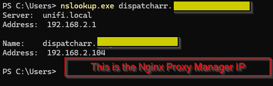
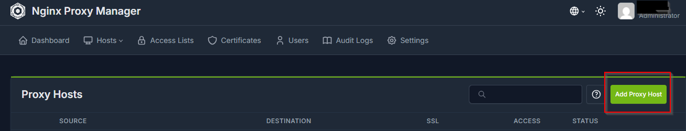
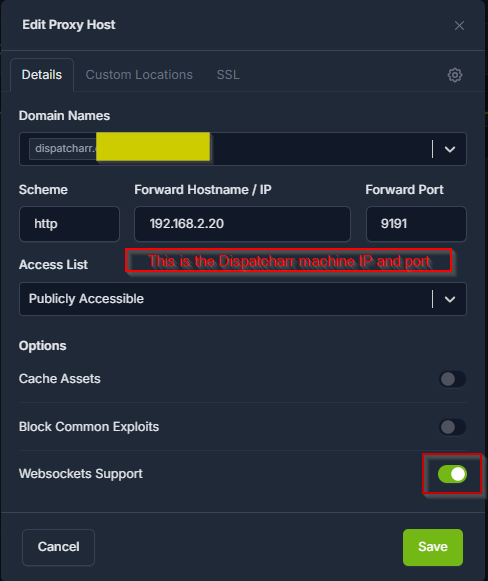
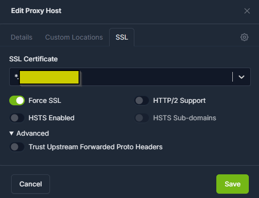
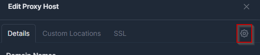
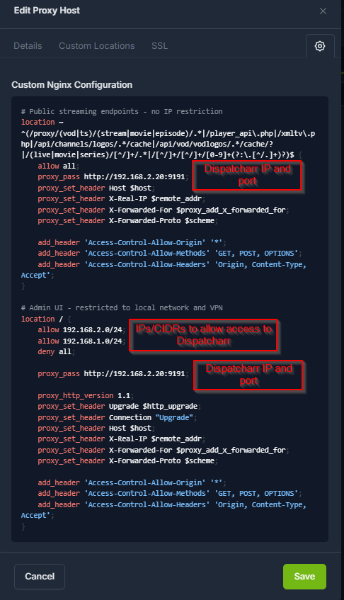
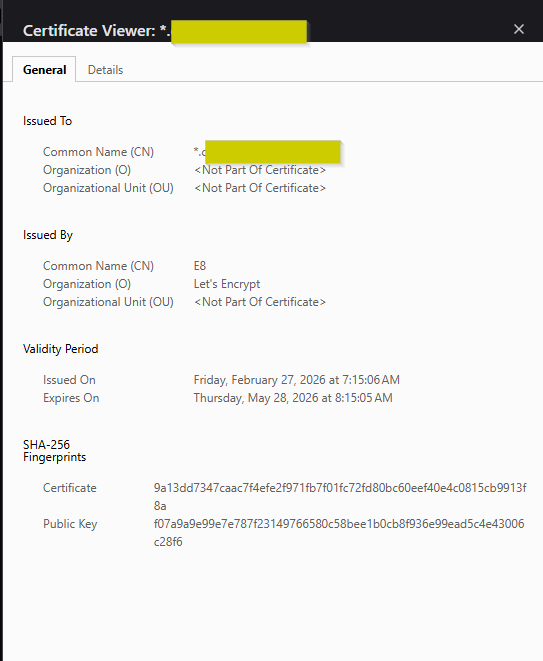
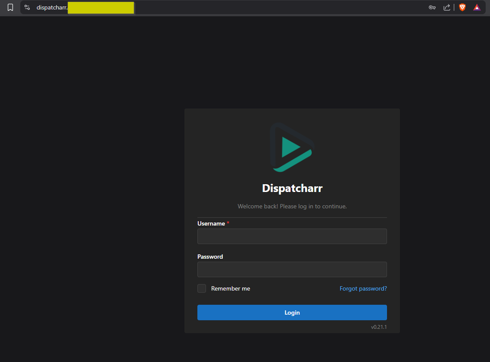
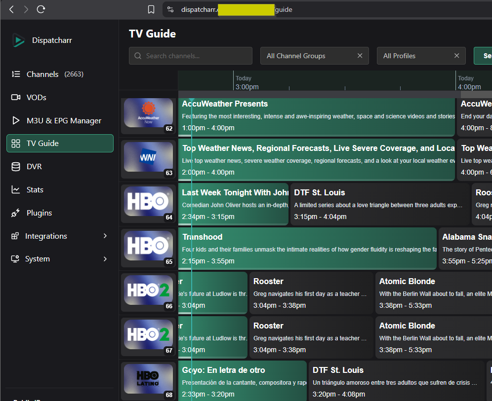

## Hardware Acceleration 
- Dispatcharr does not currently support hardware acceleration directly, but you can use hardware acceleration with custom ffmpeg stream profiles. 
- This will require mapping your hardware to the container and setting up a custom ffmpeg stream profile. 

### Mapping Hardware
=== "NVIDIA"
    - Install the [NVIDIA Container toolkit](https://docs.nvidia.com/datacenter/cloud-native/container-toolkit/latest/install-guide.html)
    - Add a deploy section to your docker-compose.yml
	??? example
	    ```yaml
		services:
		  dispatcharr:
			# build:
			#   context: .
			#   dockerfile: Dockerfile
			image: ghcr.io/dispatcharr/dispatcharr:latest
			container_name: dispatcharr
			ports:
			  - 9191:9191
			volumes:
			  - dispatcharr_data:/data
			environment:
			  - DISPATCHARR_ENV=aio
			  - REDIS_HOST=localhost
			  - CELERY_BROKER_URL=redis://localhost:6379/0
			deploy:
			  resources:
				reservations:
				  devices:
					- driver: nvidia
					  count: all
					  capabilities: [gpu]
		volumes:
		  dispatcharr_data:
		```

=== "Intel"  
    - Add a devices section to your docker-compose.yml
	??? example
	    ```yaml
		services:
		  dispatcharr:
			# build:
			#   context: .
			#   dockerfile: Dockerfile
			image: ghcr.io/dispatcharr/dispatcharr:latest
			container_name: dispatcharr
			ports:
			  - 9191:9191
			volumes:
			  - dispatcharr_data:/data
			environment:
			  - DISPATCHARR_ENV=aio
			  - REDIS_HOST=localhost
			  - CELERY_BROKER_URL=redis://localhost:6379/0
			devices:
			  - /dev/dri:/dev/dri

		volumes:
		  dispatcharr_data:
		```
		
=== "NVIDIA (Unraid)"
    - Install the NVIDIA Driver Package plugin from community apps if not already installed
    - Edit the Dispatcharr docker container in Unraid
        - Toggle Advanced View On
        - Go to Extra Parameters
            - Add `--runtime=nvidia`
        - Scroll down and click "Add another Path, Port, Variable, Label or Device"
		    - Config Type: Variable
		    - Name: `NVIDIA_VISIBLE_DEVICES`
			- Key: `NVIDIA_VISIBLE_DEVICES`
			- Value: `all`
		- Click Save
		- Again click "Add another Path, Port, Variable, Label or Device"
		    - Config Type: Variable
		    - Name: `NVIDIA_DRIVER_CAPABILITIES`
			- Key: `NVIDIA_DRIVER_CAPABILITIES`
			- Value: `all`
		- Click Save

=== "Intel (Unraid)"
    - Edit the Dispatcharr docker container in Unraid
	- Scroll down and click "Add another Path, Port, Variable, Label or Device"
		- Config Type: Device
		- Name: `/dev/dri`
		- Key: `/dev/dri`
		- Description: `Intel GPU`
    - Click Save
	
### Custom Stream Profiles
- Open Dispatcharr
- Navigate to Settings > Add Stream Profile
    - Name it anything you like
	- Command `ffmpeg`
    - Parameters will vary based on your hardware type and streaming needs
	    - See [ffmpeg docs](https://ffmpeg.org/ffmpeg.html) for more
	- Visit our [discord](https://discord.gg/Sp45V5BcxU) for more user-submitted ffmpeg parameters
	=== "NVIDIA"
	    !!! example
	        - Parameters: `-user_agent {userAgent} -hwaccel cuda -i {streamUrl} -c:v h264_nvenc -c:a copy -f mpegts pipe:1`
	
	=== "Intel VAAPI"
		!!! example
		    - Parameters: `-user_agent {userAgent} -hwaccel vaapi -hwaccel_output_format vaapi -hwaccel_device /dev/dri/renderD128 -i {streamUrl} -c:a aac -c:v h264_vaapi -f mpegts pipe:1`
		
    === "Intel QSV"
		!!! example
		    - Parameters: `-hwaccel qsv -user_agent {userAgent} -i {streamUrl} -c:v h264_qsv -c:a aac -f mpegts pipe:1`

## Process Priority Configuration
Optional environment variables to adjust priority of various tasks. Lower values = higher priority. Range: -20 (highest) to 19 (lowest). Negative values require `cap_add: SYS_NICE`  

- `UWSGI_NICE_LEVEL` - Set priority for uWSGI, FFmpeg, and streaming. Default priority is 0, recommend -5 for high priority 
- `CELERY_NICE_LEVEL` - Set priority for Celery, EPG, and other background tasks. Default priority is 5 

!!! example
    ```yaml
        environment:
          - UWSGI_NICE_LEVEL=-5
          - CELERY_NICE_LEVEL=5

        cap_add:
          - SYS_NICE
    ```
 
## Reverse Proxies
### Nginx
HTTPS config example (streams only via https, WebUI via local network and Wireguard)

??? example "Example (click to see)"
    ```nginx
    # Dispatcharr HTTPS DynuDNS
    server {
        listen 443 ssl;
        server_name dispatcharr.your.domain.com;  #Adjust for your domain

        ssl_certificate /etc/letsencrypt/live/yourdomain.com/fullchain.pem;
        ssl_certificate_key /etc/letsencrypt/live/yourdomain.com/privkey.pem;
        
        location ~ ^(/proxy/(vod|ts)/(stream|movie|episode)/.*|/player_api\.php|/xmltv\.php|/api/channels/logos/.*/cache|/api/vod/vodlogos/.*/cache/?|/(live|movie|series)/[^/]+/.*|/[^/]+/[^/]+/[0-9]+(?:\.[^/.]+)?)$ {
            allow all;  # Allow everyone else
            proxy_pass http://dispatcharrserver:9191;  # Adjust for your server name or IP
            proxy_set_header Host $host:443;
            proxy_set_header X-Real-IP $remote_addr;
            proxy_set_header X-Forwarded-For $proxy_add_x_forwarded_for;
            proxy_set_header X-Forwarded-Proto $scheme;
            # CORS settings
            add_header 'Access-Control-Allow-Origin' '*';
            add_header 'Access-Control-Allow-Methods' 'GET, POST, OPTIONS';
            add_header 'Access-Control-Allow-Headers' 'Origin, Content-Type, Accept';
        }

        location / {
            allow 10.0.0.0/22;  # Allow the local network, adjust for your network
            allow 10.1.0.0/24;  # Allow Wireguard, adjust for your network
            deny all;  # Deny everyone else
            proxy_pass http://dispatcharrserver:9191;  # Adjust for your server name or IP
            # WebSocket headers
            proxy_set_header Upgrade $http_upgrade;
            proxy_set_header Connection "Upgrade";
            proxy_set_header Host $host:443;
            proxy_set_header X-Real-IP $remote_addr;
            proxy_set_header X-Forwarded-For $proxy_add_x_forwarded_for;
            proxy_set_header X-Forwarded-Proto $scheme;
            # CORS settings
            add_header 'Access-Control-Allow-Origin' '*';
            add_header 'Access-Control-Allow-Methods' 'GET, POST, OPTIONS';
            add_header 'Access-Control-Allow-Headers' 'Origin, Content-Type, Accept';
        }
    }  
    ```

!!! note "Tip"
    Even with a properly configured reverse proxy, your M3U output may be available over the internet. Follow these best practices to block standard M3U access and allow only with a specified username and password. 
	
    1. Set up your reverse proxy as shown in the [docs](/Dispatcharr-Docs/advanced/#nginx-reverse-proxy)
    2. In dispatcharr at Settings > [Network Access](/Dispatcharr-Docs/system/#network-access), restrict M3U / EPG Endpoints to your local network only (example: 192.168.1.0/24)
    3. Set up a user with XC password on the [Users](/Dispatcharr-Docs/system/#users) page if you haven't already done so
    4. Use the following m3u link format to share with your users: `https://hostname/get.php?username=XCUSERNAME&password=XCPASSWORD`
    5. And this format for epg: `https://hostname/xmltv.php?username=XCUSERNAME&password=XCPASSWORD`

---
    
### Pangolin
* Create your resource just as you would any other in Pangolin
* If you're hosting Dispatcharr on the same VPS (if you're using a VPS) as Pangolin, be sure to set it as a local resource and use 172.XX.X.X as the IP, then enter the port. Otherwise set it up normally
* If you'd like to enable Pangolin's SSO for this resource for security, do so in the Authentication tab of your new Dispatcharr resource

To allow Dispatcharr to connect to clients when secured behind Pangolin SSO or another IdP you've added, you need to create Bypass Rules. See below for the list of rules required. Once you save the below rules, Dispatcharr's WebUI will be secured behind your SSO while apps and services will be able to connect via XC

* The "Action" will be `Bypass Auth` for all of them
* The "Match Type" will be `Path` for all of them

??? example "Bypass rules (click to see)"

    * ```/player_api.php/*```
    * ```/get.php/*```
    * ```/xmltv.php/*```
    * ```/*/*/*.ts```
    * ```/proxy/ts/stream/*```
    * ```/proxy/vod/episode/*```
    * ```/proxy/vod/movie/*```
    * ```/api/channels/logos/*/cache/```
    * ```/live/*/*```
    * ```/movie/*/*```
    * ```/series/*/*```

    **(Optional for HDHR, M3U, and/or EPG URL access, not required if using XC. If you're using HDHR, M3U, or EPG, you should further restrict it in dispatcharr's [Settings > Network Access > M3U / EPG Endpoints)](/Dispatcharr-Docs/system/#network-access). Otherwise, your HDHR, M3U, and/or EPG links will be publicly accessible over the internet** 
    
    * ```/hdhr/*```
    * ```/output/m3u/*```
    * ```/output/epg/*```

* If you'd like to set up GeoBlock for any/all resources, refer to Pangolin's [official documentation](https://docs.pangolin.net/self-host/advanced/enable-geoblocking) for guidance

* Test your new setup by navigating to Dispatcharr in an incognito or private window. You should now be met with your Pangolin login dashboard when accessing the WebUI when you're not authenticated, however your clients will still be able to connect to allow streaming


### Nginx Proxy Manager

Follow these steps to setup access to Dispatcharr through Nginx Proxy Manager.  This guide assumes that Nginx Proxy Manager is already setup and has SSL certificates configured.  Setting up Nginx Proxy Manager and certs is out of scope for this guide.  You can find setup info at the [Nginx Proxy Manager](https://nginxproxymanager.com/guide/) install guide and at [this blog](https://medium.com/@life-is-short-so-enjoy-it/homelab-nginx-proxy-manager-setup-ssl-certificate-with-domain-name-in-cloudflare-dns-732af64ddc0b).

* This was created on version 2.14.0 of Nginx Proxy Manager.  Other versions have not been tested
* Domain is blurred out for privacy.  You can purchase a domain or create a local use domain.  Setting up a domain is out of scope, but there are lots of guides that cover this

1. Setup Nginx Proxy Manager.  See above link for instructions

1. Create DNS entry resolving Dispatcharr domain name to Nginx Proxy Manager LAN IP
    ??? info "Screenshot" 
        


    1. This step is dependent on what router you use

1. Create new proxy host in Nginx Proxy Manager
    ??? info "Screenshot" 
        

1. Enter the domain name created in step 2

1. Scheme: `http`

1. Forward Hostname/IP: `<IP address of Dispatcharr server>`  

1. Forward port: `9191`

1. Select `Websockets Support`

    ??? info "Screenshot" 
        

    !!! note
        The custom SSL config added in step 14 also sets the Websocket support.  We've tested with `Websocket Support` toggled on and off and have not noticed a difference

1. Select SSL (on the top tap under `Edit Proxy Host`)

1. Choose your SSL certificate

    1. Creating SSL certs is outside the scope of this guide.  See [above link](https://nginxproxymanager.com/guide/) for the Nginx Proxy Manager install documentation

    1. Recommend setting up wildcard SSL certs for your domain.  If using Cloudflare for your domain, see [this guide](https://blog.jverkamp.com/2023/03/27/wildcard-lets-encrypt-certificates-with-nginx-proxy-manager-and-cloudflare/) for instructions

1. Select `Force SSL`
    ??? info "Screenshot" 
        

1. Select `Details` tab

1. Select the gear icon for custom Nginx configuration
    ??? info "Screenshot" 
        


1. Paste in the below config example, making sure to change the variable names as needed.  Variables are in <> and ALL CAPS.  Values to change are the Nginx Proxy Manager IP and the Dispatcharr IP

    ??? example "Example (click to see)"
        ```nginx
        # Dispatcharr HTTPS Nginx Proxy Manager
        location ~ ^(/proxy/(vod|ts)/(stream|movie|episode)/.*|/player_api\.php|/xmltv\.php|/api/channels/logos/.*/cache|/api/vod/vodlogos/.*/cache/?|/(live|movie|series)/[^/]+/.*|/[^/]+/[^/]+/[0-9]+(?:\.[^/.]+)?)$ {
            allow all;
            proxy_pass http://<DISPATCHARR IP ADDRESS>:9191;
            proxy_set_header Host $host;
            proxy_set_header X-Real-IP $remote_addr;
            proxy_set_header X-Forwarded-For $proxy_add_x_forwarded_for;
            proxy_set_header X-Forwarded-Proto $scheme;

            add_header 'Access-Control-Allow-Origin' '*';
            add_header 'Access-Control-Allow-Methods' 'GET, POST, OPTIONS';
            add_header 'Access-Control-Allow-Headers' 'Origin, Content-Type
        Accept';
        }

        # Restrict access.  In this instance all traffic to Dispatcharr flows through proxy.  You can add another allow block if you want to allow traffic not through the proxy. 
        location / {
            allow <NPM IP ADDRESS>/32;
            deny all;

            proxy_pass http://<DISPATCHARR IP ADDRESS>:9191;

            proxy_http_version 1.1;
            proxy_set_header Upgrade $http_upgrade;
            proxy_set_header Connection "Upgrade";
            proxy_set_header Host $host;
            proxy_set_header X-Real-IP $remote_addr;
            proxy_set_header X-Forwarded-For $proxy_add_x_forwarded_for;
            proxy_set_header X-Forwarded-Proto $scheme;

            add_header 'Access-Control-Allow-Origin' '*';
            add_header 'Access-Control-Allow-Methods' 'GET, POST, OPTIONS';
            add_header 'Access-Control-Allow-Headers' 'Origin, Content-Type
        Accept';
        }
        ```

    ??? info "Screenshot" 
        


1. Select `Save`

1. Verify access by visiting Dispatcharr DNS name in browser.  Verify that the SSL certificate is valid.
    ??? info "Screenshot" 
        

1. Login and enjoy!
    ??? info "Screenshot" 
        


        

    !!! note
        If you point Pangolin at the Nginx Proxy Manager as a resource, you can access Dispatcharr through this instead of creating a new entry.