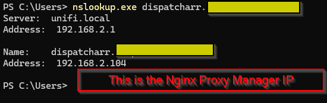
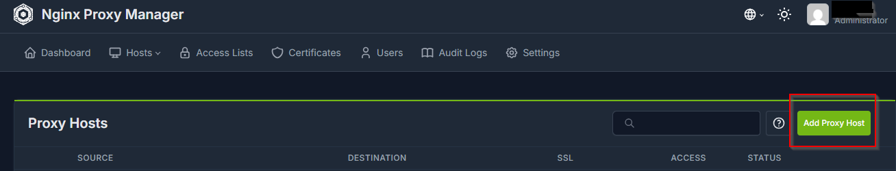
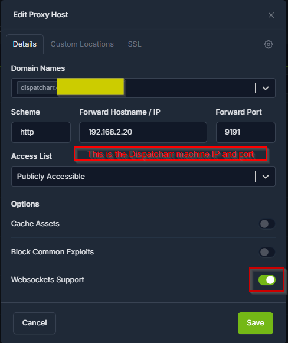
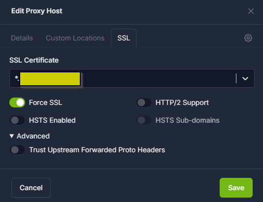
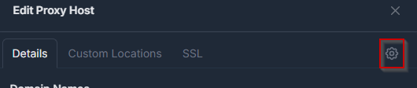
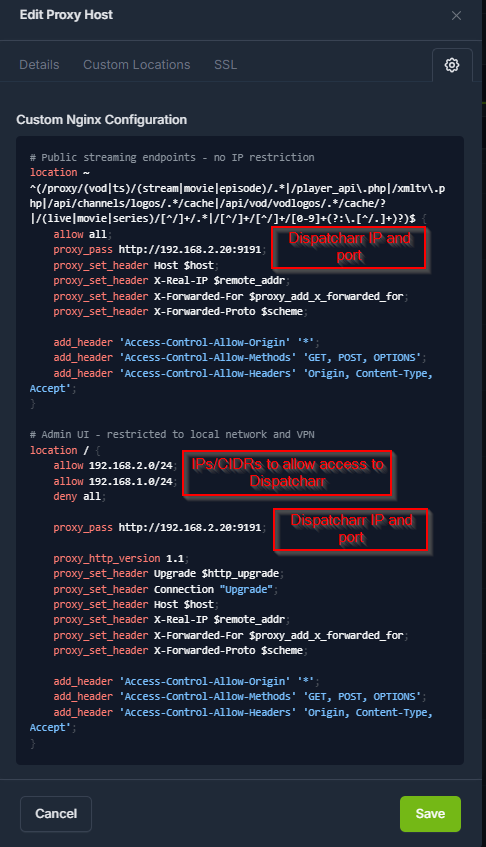
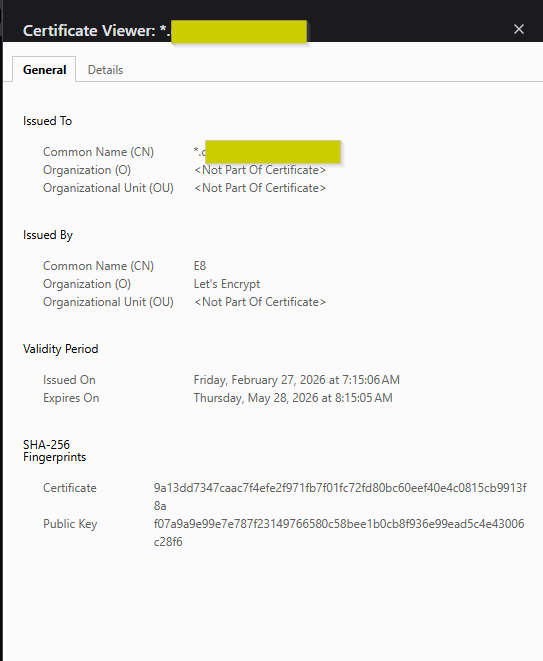
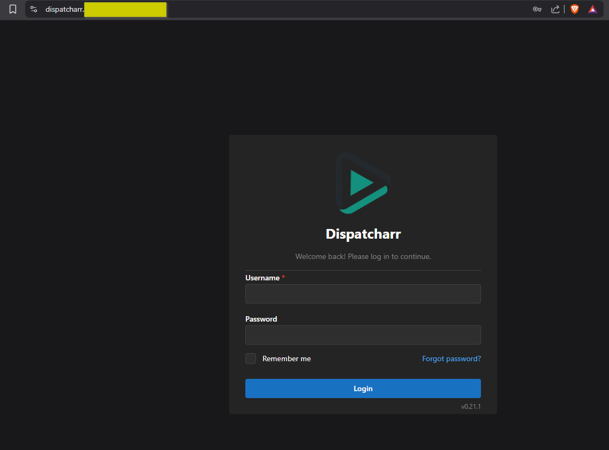
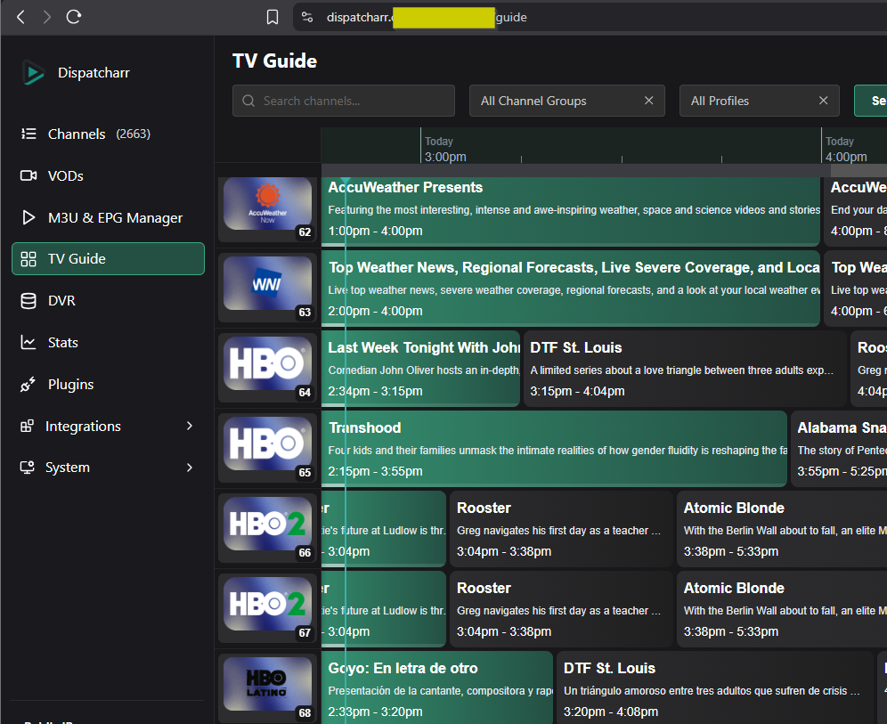

## Hardware Acceleration 
- Dispatcharr does not currently support hardware acceleration directly, but you can use hardware acceleration with custom ffmpeg stream profiles. 
- This will require mapping your hardware to the container and setting up a custom ffmpeg stream profile. 

### Mapping Hardware
=== "NVIDIA"
    - Install the [NVIDIA Container toolkit](https://docs.nvidia.com/datacenter/cloud-native/container-toolkit/latest/install-guide.html)
    - Add a deploy section to your docker-compose.yml
	??? example
	    ```yaml
		services:
		  dispatcharr:
			# build:
			#   context: .
			#   dockerfile: Dockerfile
			image: ghcr.io/dispatcharr/dispatcharr:latest
			container_name: dispatcharr
			ports:
			  - 9191:9191
			volumes:
			  - dispatcharr_data:/data
			environment:
			  - DISPATCHARR_ENV=aio
			  - REDIS_HOST=localhost
			  - CELERY_BROKER_URL=redis://localhost:6379/0
			deploy:
			  resources:
				reservations:
				  devices:
					- driver: nvidia
					  count: all
					  capabilities: [gpu]
		volumes:
		  dispatcharr_data:
		```

=== "Intel"  
    - Add a devices section to your docker-compose.yml
	??? example
	    ```yaml
		services:
		  dispatcharr:
			# build:
			#   context: .
			#   dockerfile: Dockerfile
			image: ghcr.io/dispatcharr/dispatcharr:latest
			container_name: dispatcharr
			ports:
			  - 9191:9191
			volumes:
			  - dispatcharr_data:/data
			environment:
			  - DISPATCHARR_ENV=aio
			  - REDIS_HOST=localhost
			  - CELERY_BROKER_URL=redis://localhost:6379/0
			devices:
			  - /dev/dri:/dev/dri

		volumes:
		  dispatcharr_data:
		```
		
=== "NVIDIA (Unraid)"
    - Install the NVIDIA Driver Package plugin from community apps if not already installed
    - Edit the Dispatcharr docker container in Unraid
        - Toggle Advanced View On
        - Go to Extra Parameters
            - Add `--runtime=nvidia`
        - Scroll down and click "Add another Path, Port, Variable, Label or Device"
		    - Config Type: Variable
		    - Name: `NVIDIA_VISIBLE_DEVICES`
			- Key: `NVIDIA_VISIBLE_DEVICES`
			- Value: `all`
		- Click Save
		- Again click "Add another Path, Port, Variable, Label or Device"
		    - Config Type: Variable
		    - Name: `NVIDIA_DRIVER_CAPABILITIES`
			- Key: `NVIDIA_DRIVER_CAPABILITIES`
			- Value: `all`
		- Click Save

=== "Intel (Unraid)"
    - Edit the Dispatcharr docker container in Unraid
	- Scroll down and click "Add another Path, Port, Variable, Label or Device"
		- Config Type: Device
		- Name: `/dev/dri`
		- Key: `/dev/dri`
		- Description: `Intel GPU`
    - Click Save
	
### Custom Stream Profiles
- Open Dispatcharr
- Navigate to Settings > Add Stream Profile
    - Name it anything you like
	- Command `ffmpeg`
    - Parameters will vary based on your hardware type and streaming needs
	    - See [ffmpeg docs](https://ffmpeg.org/ffmpeg.html) for more
	- Visit our [discord](https://discord.gg/Sp45V5BcxU) for more user-submitted ffmpeg parameters
	=== "NVIDIA"
	    !!! example
	        - Parameters: `-user_agent {userAgent} -hwaccel cuda -i {streamUrl} -c:v h264_nvenc -c:a copy -f mpegts pipe:1`
	
	=== "Intel VAAPI"
		!!! example
		    - Parameters: `-user_agent {userAgent} -hwaccel vaapi -hwaccel_output_format vaapi -hwaccel_device /dev/dri/renderD128 -i {streamUrl} -c:a aac -c:v h264_vaapi -f mpegts pipe:1`
		
    === "Intel QSV"
		!!! example
		    - Parameters: `-hwaccel qsv -user_agent {userAgent} -i {streamUrl} -c:v h264_qsv -c:a aac -f mpegts pipe:1`

## Process Priority Configuration
Optional environment variables to adjust priority of various tasks. Lower values = higher priority. Range: -20 (highest) to 19 (lowest). Negative values require `cap_add: SYS_NICE`  

- `UWSGI_NICE_LEVEL` - Set priority for uWSGI, FFmpeg, and streaming. Default priority is 0, recommend -5 for high priority 
- `CELERY_NICE_LEVEL` - Set priority for Celery, EPG, and other background tasks. Default priority is 5 

!!! example
    ```yaml
        environment:
          - UWSGI_NICE_LEVEL=-5
          - CELERY_NICE_LEVEL=5

        cap_add:
          - SYS_NICE
    ```
 
## Reverse Proxies
### Nginx

This example splits Dispatcharr across separate location blocks, one per exposure decision, so you can publish the Xtream Codes API to the internet while keeping the web UI and the credential-free endpoints on networks you trust.

The trusted-network list lives once in the `server` block. Every location inherits it, so anything you do not explicitly open stays private, including any block you add later. A block goes public by declaring `allow all;`, which replaces the inherited list for that location only.

As written, the internet can reach the Xtream Codes API (`player_api.php`, `panel_api.php`, `get.php`, `xmltv.php`), Xtream Codes playback (`/live/`, `/movie/`, `/series/`, `/timeshift/`), and the artwork URLs that players need for logos and covers. Everything else stays on your trusted networks: the web UI and its login page, `/api/`, the WebSocket, the internal stream proxy under `/proxy/`, and the plain `/output/m3u`, `/output/epg`, and `/hdhr/` endpoints.

??? example "Example (click to see)"
    ```nginx
    # /etc/nginx/conf.d/dispatcharr.conf

    # Change the address once here; every location below points at it.
    upstream dispatcharr {
        server 10.0.0.10:9191;   # Adjust for your Dispatcharr host or IP
    }

    # "Connection: upgrade" for WebSockets, "close" for everything else.
    map $http_upgrade $dispatcharr_connection {
        default upgrade;
        ''      close;
    }

    server {
        listen 80;
        listen [::]:80;
        server_name dispatcharr.your.domain.com;   # Adjust for your domain
        return 301 https://$host$request_uri;
    }

    server {
        listen 443 ssl;
        listen [::]:443 ssl;
        server_name dispatcharr.your.domain.com;   # Adjust for your domain

        ssl_certificate     /etc/letsencrypt/live/yourdomain.com/fullchain.pem;
        ssl_certificate_key /etc/letsencrypt/live/yourdomain.com/privkey.pem;

        # Streams and playlist uploads are not size-bound.
        client_max_body_size 0;

        # ===============================================================
        # Trusted networks
        #
        # Every location inherits this list, so the default for anything
        # not named below is "private only". A location opts out with its
        # own "allow all;", which replaces the whole list for that location
        # (nginx inherits allow/deny only into locations that declare none).
        #
        # Each block below is therefore one decision:
        #     allow all;   reachable from anywhere
        #     no allow     trusted networks only
        #
        # Add your VPN subnet if it falls outside these, and delete the
        # ranges you do not use.
        # ===============================================================
        allow 127.0.0.0/8;       # loopback
        allow 10.0.0.0/8;        # private
        allow 172.16.0.0/12;     # private
        allow 192.168.0.0/16;    # private
        allow ::1/128;           # loopback
        allow fc00::/7;          # unique local
        allow fe80::/10;         # link-local
        # allow 100.64.0.0/10;   # Tailscale and other CGNAT clients
        deny all;

        # Set once here and inherited by every location below. A location that
        # declares its own proxy_set_header drops all of these, so none of them do.
        proxy_http_version 1.1;
        proxy_set_header Host              $host;
        proxy_set_header Upgrade           $http_upgrade;
        proxy_set_header Connection        $dispatcharr_connection;
        proxy_set_header X-Real-IP         $remote_addr;
        proxy_set_header X-Forwarded-For   $proxy_add_x_forwarded_for;
        proxy_set_header X-Forwarded-Proto $scheme;
        proxy_set_header X-Forwarded-Host  $host;
        proxy_set_header X-Forwarded-Port  $server_port;

        # ---------------------------------------------------------------
        # 1. Artwork. PUBLIC.
        # The XC API and the players hand out absolute image URLs on this
        # hostname, so remote clients must reach these or covers, logos,
        # and guide posters come up blank.
        #   /api/channels/logos/{id}/cache/                 channel logos
        #   /api/vod/vodlogos/{id}/cache/                   movie/series covers
        #   /api/vod/{movies|series|episodes}/{id}/image/   backdrops and stills
        #   /api/epg/programs/{id}/poster/                  Schedules Direct posters
        # No credentials, but nothing here is more than a picture, and
        # Dispatcharr's own nginx already caches them, so there is no second
        # cache layer here.
        # ---------------------------------------------------------------
        location ~ ^/api/(?:channels/logos/\d+/cache|vod/vodlogos/\d+/cache|vod/(?:movies|series|episodes)/\d+/image|epg/programs/\d+/poster)/?$ {
            allow all;

            proxy_pass http://dispatcharr;
        }

        # ---------------------------------------------------------------
        # 2. Xtream Codes API. PUBLIC.
        # Every one of these requires a username and the user's XC password
        # as query parameters, so publishing them is what lets a remote XC
        # player log in at all.
        #   player_api.php   handshake, categories, streams, VOD info
        #   panel_api.php    same, for clients that ask for it instead
        #   get.php          the M3U, containing /live/{user}/{pass}/ URLs
        #   xmltv.php        the guide
        # Because the playlist carries the user's own credentials, sharing
        # a get.php link shares that one account, and Settings > Users can
        # revoke it. This is the supported way to hand out a playlist. The
        # credential-free equivalents are in block 5.
        # ---------------------------------------------------------------
        location ~ ^/(?:player_api|panel_api|get|xmltv)\.php(?:/|$) {
            allow all;

            proxy_pass http://dispatcharr;

            # A full playlist or guide can take a while to build.
            proxy_read_timeout 300s;
            proxy_send_timeout 300s;
        }

        # ---------------------------------------------------------------
        # 3. Xtream Codes playback. PUBLIC.
        # The URLs handed out by block 2, credentials in the path.
        #   /live|/movie|/series/{user}/{pass}/...  live and VOD
        #   /timeshift/{user}/{pass}/...            catch-up, path form
        #   /streaming/timeshift.php                catch-up, query form
        # These stream from Dispatcharr directly; an XC client never needs
        # the /proxy/ routes in block 4.
        # ---------------------------------------------------------------
        location ~ ^/(?:(?:live|movie|series)/[^/]+/[^/]+/|timeshift/[^/]+/[^/]+/[^/]+/[^/]+/|streaming/timeshift\.php(?:/|$)) {
            allow all;

            proxy_pass http://dispatcharr;

            # Buffering off so nginx does not sit on stream data. The
            # timeouts are idle gaps against Dispatcharr, not a total
            # stream length: each resets whenever either side moves a
            # byte. A paused client is a different timer (send_timeout,
            # left at nginx's default) and is decided inside
            # Dispatcharr's own nginx, not here.
            proxy_buffering         off;
            proxy_request_buffering off;
            proxy_read_timeout      3600s;
            proxy_send_timeout      3600s;
        }

        # Optional, part of block 3: the legacy XC form "/{user}/{pass}/{id}",
        # which a few players use instead of "/live/{user}/{pass}/{id}".
        # Uncomment only if a client needs it. The lookahead keeps the app's
        # own prefixes out; without it the pattern also swallows three-segment
        # URLs like /api/channels/streams. It still catches any three-segment
        # web UI route, which then serves the (public) web UI shell.
        #
        # location ~ ^/(?!api/|proxy/|output/|hdhr/|admin/|ws/|static/|assets/|logos/)[^/]+/[^/]+/[^/]+$ {
        #     allow all;
        #
        #     proxy_pass http://dispatcharr;
        #
        #     proxy_buffering         off;
        #     proxy_request_buffering off;
        #     proxy_read_timeout      3600s;
        #     proxy_send_timeout      3600s;
        # }

        # ---------------------------------------------------------------
        # 4. Internal stream proxy. TRUSTED ONLY.
        #   /proxy/ts/stream/{uuid}                 live
        #   /proxy/vod/{movie|episode|series}/...   VOD
        #   /proxy/catchup/{uuid}                   catch-up
        # These are what the web UI player, the plain M3U, and the HDHR
        # lineup point at. They accept a UUID and no credentials, so anyone
        # holding the URL can stream; only Settings > Network Access >
        # Streams stands behind them. Add "allow all;" only alongside
        # block 5.
        # The patterns are deliberately narrow: the sibling stats/,
        # status/, stop/, and stop_client/ routes are admin-only and are
        # left to block 6. Quotes are required because of the {36}.
        # ---------------------------------------------------------------
        location ~ "^/proxy/(?:ts/stream/|vod/(?:movie|episode|series)/|catchup/[0-9a-fA-F-]{36})" {
            proxy_pass http://dispatcharr;

            # Same buffering and idle-timeout notes as block 3.
            proxy_buffering         off;
            proxy_request_buffering off;
            proxy_read_timeout      3600s;
            proxy_send_timeout      3600s;
        }

        # ---------------------------------------------------------------
        # 5. Plain outputs. TRUSTED ONLY.
        #   /output/m3u[/{profile}]   playlist
        #   /output/epg[/{profile}]   guide
        #   /hdhr/...                 HDHomeRun emulation, for Plex etc.
        # The prefix match covers every profile form under /hdhr/:
        # bare, /{channel_profile}/..., /output_profile/{id}/..., and
        # /{channel_profile}/output_profile/{id}/....
        # No credentials anywhere: the URL is the only thing needed, it
        # exposes every channel in the profile, and there is no per-user
        # revocation. Prefer block 2's get.php for anything leaving the
        # house. Dispatcharr also defaults Settings > Network Access >
        # M3U / EPG Endpoints to private ranges, so publishing this block
        # alone is not enough, which is deliberate.
        # ---------------------------------------------------------------
        location ~ ^/(?:output|hdhr)(?:/|$) {
            proxy_pass http://dispatcharr;

            proxy_read_timeout 300s;
            proxy_send_timeout 300s;
        }

        # ---------------------------------------------------------------
        # 6. Everything else. TRUSTED ONLY.
        # The web UI and its login page, /api/, the /ws/ WebSocket, Swagger,
        # DVR recording playback, and the admin-only stream control routes
        # left over from block 4. This is the whole management surface, and
        # the pieces are not separable: the login page is useless without
        # /api/ and /ws/ behind it.
        # Publishing this means publishing the login form. Dispatcharr's UI
        # network policy defaults to allowing every address, so this list is
        # the only thing in front of it unless you also narrow Settings >
        # Network Access > UI.
        # ---------------------------------------------------------------
        location / {
            proxy_pass http://dispatcharr;

            proxy_read_timeout 300s;
            proxy_send_timeout 300s;
        }
    }
    ```

!!! warning "Trusted networks are matched on the address nginx sees"
    If a tunnel, CDN, or another reverse proxy sits in front of this one, every request arrives from that hop instead of from the client. When that hop holds a private address, the trusted list admits the entire internet. Check your access log and confirm the addresses there are real client addresses before relying on it.

    If there is a hop in front, recover the client address at the top of the server block, listing the hop's address and never a client's:

    ```nginx
    set_real_ip_from  172.18.0.0/16;
    real_ip_header    X-Forwarded-For;
    real_ip_recursive on;
    ```

!!! note "Tip: share a playlist with credentials, not a bare URL"
    `/output/m3u` and `/output/epg` take no credentials, hand out every channel in the profile, and cannot be revoked for one person, which is why the example above keeps them private. `get.php` and `xmltv.php` take a username and XC password, so each user gets a link you can revoke individually.

    1. Set up your reverse proxy as shown above
    2. In Dispatcharr at Settings > [Network Access](/Dispatcharr-Docs/system/#network-access), restrict M3U / EPG Endpoints to your local network only (example: 192.168.1.0/24)
    3. Set up a user with an XC password on the [Users](/Dispatcharr-Docs/system/#users) page if you haven't already done so
    4. Use the following m3u link format to share with your users: `https://hostname/get.php?username=XCUSERNAME&password=XCPASSWORD`
    5. And this format for epg: `https://hostname/xmltv.php?username=XCUSERNAME&password=XCPASSWORD`

    If you do publish the plain outputs anyway, publish block 4 with them. `/output/m3u` and `/hdhr/lineup.json` hand out stream URLs under `/proxy/ts/stream/`, so on its own the playlist downloads but nothing plays. Xtream Codes clients never need `/proxy/`; they stream from `/live/`, `/movie/`, `/series/`, and `/timeshift/` directly.

!!! note "Client IP addresses inside Dispatcharr"
    Dispatcharr's own Network Access rules, its logs, and its per-user connection limits all key off the client address. It only honors `X-Real-IP` and `X-Forwarded-For` when the request reaches it from a trusted proxy, which defaults to the private ranges. If your reverse proxy reaches Dispatcharr from a public address, set `DISPATCHARR_TRUSTED_PROXIES` to that address, or every client will be logged and filtered as the proxy itself.

---
    
### Pangolin
* Create your resource just as you would any other in Pangolin
* If you're hosting Dispatcharr on the same VPS (if you're using a VPS) as Pangolin, be sure to set it as a local resource and use 172.XX.X.X as the IP, then enter the port. Otherwise set it up normally
* If you'd like to enable Pangolin's SSO for this resource for security, do so in the Authentication tab of your new Dispatcharr resource

To allow Dispatcharr to connect to clients when secured behind Pangolin SSO or another IdP you've added, you need to create Bypass Rules. See below for the list of rules required. Once you save the below rules, Dispatcharr's WebUI will be secured behind your SSO while apps and services will be able to connect via XC

* The "Action" will be `Bypass Auth` for all of them
* The "Match Type" will be `Path` for all of them

??? example "Bypass rules (click to see)"

    * ```/player_api.php/*```
    * ```/get.php/*```
    * ```/xmltv.php/*```
    * ```/*/*/*.ts```
    * ```/proxy/ts/stream/*```
    * ```/proxy/vod/episode/*```
    * ```/proxy/vod/movie/*```
    * ```/api/channels/logos/*/cache/```
    * ```/live/*/*```
    * ```/movie/*/*```
    * ```/series/*/*```
    * ```/timeshift/*```
    * ```/streaming/timeshift.php```

    **(Optional for HDHR, M3U, and/or EPG URL access, not required if using XC. If you're using HDHR, M3U, or EPG, you should further restrict it in dispatcharr's [Settings > Network Access > M3U / EPG Endpoints)](/Dispatcharr-Docs/system/#network-access). Otherwise, your HDHR, M3U, and/or EPG links will be publicly accessible over the internet** 
    
    * ```/hdhr/*```
    * ```/output/m3u/*```
    * ```/output/epg/*```

* If you'd like to set up GeoBlock for any/all resources, refer to Pangolin's [official documentation](https://docs.pangolin.net/self-host/advanced/enable-geoblocking) for guidance

* Test your new setup by navigating to Dispatcharr in an incognito or private window. You should now be met with your Pangolin login dashboard when accessing the WebUI when you're not authenticated, however your clients will still be able to connect to allow streaming

---

### Nginx Proxy Manager

Follow these steps to setup access to Dispatcharr through Nginx Proxy Manager.  This guide assumes that Nginx Proxy Manager is already setup and has SSL certificates configured.  Setting up Nginx Proxy Manager and certs is out of scope for this guide.  You can find setup info at the [Nginx Proxy Manager](https://nginxproxymanager.com/guide/) install guide and at [this blog](https://medium.com/@life-is-short-so-enjoy-it/homelab-nginx-proxy-manager-setup-ssl-certificate-with-domain-name-in-cloudflare-dns-732af64ddc0b).

* This was created on version 2.14.0 of Nginx Proxy Manager.  Other versions have not been tested
* Domain is blurred out for privacy.  You can purchase a domain or create a local use domain.  Setting up a domain is out of scope, but there are lots of guides that cover this

1. Setup Nginx Proxy Manager.  See above link for instructions

1. Create DNS entry resolving Dispatcharr domain name to Nginx Proxy Manager LAN IP
    * This step is dependent on what router you use

    ??? info "Screenshot" 
        

1. Create new proxy host in Nginx Proxy Manager

    ??? info "Screenshot" 
        

1. Enter the domain name created in step 2

1. Scheme: `http`

1. Forward Hostname/IP: `<IP address of Dispatcharr server>`  

1. Forward port: `9191`

1. Select `Websockets Support`

    ??? info "Screenshot" 
        

    !!! note
        The custom SSL config added in step 14 also sets the Websocket support.  We've tested with `Websocket Support` toggled on and off and have not noticed a difference

1. Select SSL (on the top tap under `Edit Proxy Host`)

1. Choose your SSL certificate

    * Creating SSL certs is outside the scope of this guide.  See [above link](https://nginxproxymanager.com/guide/) for the Nginx Proxy Manager install documentation

    * Recommend setting up wildcard SSL certs for your domain.  If using Cloudflare for your domain, see [this guide](https://blog.jverkamp.com/2023/03/27/wildcard-lets-encrypt-certificates-with-nginx-proxy-manager-and-cloudflare/) for instructions

1. Select `Force SSL`

    ??? info "Screenshot" 
        

1. Select `Details` tab

1. Select the gear icon for custom Nginx configuration

    ??? info "Screenshot" 
        


1. Paste in the below config example, making sure to change the variable names as needed.  Variables are in <> and ALL CAPS.  Values to change are the Nginx Proxy Manager IP and the Dispatcharr IP

    ??? example "Example (click to see)"
        ```nginx
        # Dispatcharr HTTPS Nginx Proxy Manager
        location ~ ^(/proxy/(vod|ts)/(stream|movie|episode)|/proxy/catchup/.*|/player_api.php|/xmltv.php|/api/channels/logos/.*/cache|/(live|movie|series)/[^/]+/.*|/timeshift/[^/]+/[^/]+/[^/]+/[^/]+/.*|/streaming/timeshift\.php)  {
            allow all;
            proxy_pass http://<DISPATCHARR IP ADDRESS>:9191;
            proxy_set_header Host $host;
            proxy_set_header X-Real-IP $remote_addr;
            proxy_set_header X-Forwarded-For $proxy_add_x_forwarded_for;
            proxy_set_header X-Forwarded-Proto $scheme;

            add_header 'Access-Control-Allow-Origin' '*';
            add_header 'Access-Control-Allow-Methods' 'GET, POST, OPTIONS';
            add_header 'Access-Control-Allow-Headers' 'Origin, Content-Type, Accept';
        }

        # Restrict access.  In this instance all traffic to Dispatcharr flows through proxy.  You can add another allow block if you want to allow traffic not through the proxy. 
        location / {
            allow <NPM IP ADDRESS>/32;
            deny all;

            proxy_pass http://<DISPATCHARR IP ADDRESS>:9191;

            proxy_http_version 1.1;
            proxy_set_header Upgrade $http_upgrade;
            proxy_set_header Connection "Upgrade";
            proxy_set_header Host $host;
            proxy_set_header X-Real-IP $remote_addr;
            proxy_set_header X-Forwarded-For $proxy_add_x_forwarded_for;
            proxy_set_header X-Forwarded-Proto $scheme;

            add_header 'Access-Control-Allow-Origin' '*';
            add_header 'Access-Control-Allow-Methods' 'GET, POST, OPTIONS';
            add_header 'Access-Control-Allow-Headers' 'Origin, Content-Type
        Accept';
        }
        ```

    ??? info "Screenshot" 
        


1. Select `Save`

1. Verify access by visiting Dispatcharr DNS name in browser.  Verify that the SSL certificate is valid.

    ??? info "Screenshot" 
        

1. Login and enjoy!

    ??? info "Screenshot" 
        

        

    !!! note
        If you point Pangolin at the Nginx Proxy Manager as a resource, you can access Dispatcharr through this instead of creating a new entry.

### Caddy
HTTPS config example (streams only via XC API)

??? example "Example (click to see)"
    ```
    example.domain.com {
            encode zstd gzip

            log {
                    output file /data/caddy/logs/caddy.log
                    level INFO
            }

            tls {
                    protocols tls1.2 tls1.3
            }

            header {
                    Strict-Transport-Security "max-age=63072000; includeSubDomains; preload"
                    X-Content-Type-Options "nosniff"
                    X-Frame-Options "SAMEORIGIN"
                    Referrer-Policy "no-referrer"
                    Permissions-Policy "camera=(), microphone=(), geolocation=()"
                    Content-Security-Policy "default-src 'none'; frame-ancestors 'none';"
            }

            @iptv {
                path_regexp ^(/proxy/(vod|ts)/(stream|movie|episode)|/proxy/catchup/.*|/player_api.php|/xmltv.php|/api/channels/logos/.*/cache|/(live|movie|series)/[^/]+/.*|/timeshift/[^/]+/[^/]+/[^/]+/[^/]+/.*|/streaming/timeshift\.php)
            }

            handle @iptv {
                    reverse_proxy X.X.X.X:9191 {
                            header_up X-Forwarded-For {remote_host}
                            header_up X-Real-IP {remote_host}
                            header_up Host {host}
                            header_up X-Forwarded-Proto {scheme}

                            transport http {
                                    versions 1.1 2
                                    read_timeout 3600s
                                    write_timeout 3600s
                            }
                    }
            }

            handle {
                    log_name view
                    respond "Forbidden" 403
            }
    }
    ```

---

## Connection Security

TLS encrypts connections between Dispatcharr and external Redis/PostgreSQL services in [modular deployments](/Dispatcharr-Docs/installation/#modular-deployment). This prevents credentials and data from being sent in plaintext over the network.

!!! note
    Connection security is only available in modular deployment mode. AIO mode uses internal services that do not require encryption.

### Overview

Three levels of connection security are supported:

| Level | What it does | When to use |
| ----- | ------------ | ----------- |
| **TLS** | Encrypts traffic between Dispatcharr and the database | Connections cross a network boundary |
| **TLS + Server Verification** | Encrypts traffic and verifies the server's identity using a CA certificate | Protecting against man-in-the-middle attacks |
| **Mutual TLS (mTLS)** | Both sides verify each other with certificates | The database server requires client authentication |

Each level builds on the previous one. You can enable encryption without verification, or verification without mutual TLS.

### Certificate Volume Mount

Server verification and mutual TLS require certificate files to be accessible inside the container. If you are only encrypting the connection without verification, no certificate files are needed.

Mount a directory containing your certificates as a read-only volume:

```yaml
volumes:
  - ./data:/data
  - ./certs:/certs:ro  # TLS certificates
```

Mount the same volume on both the `web` and `celery` services.

### Redis TLS

| Variable | Required | Description |
| -------- | :------: | ----------- |
| `REDIS_SSL` | Yes | Set to `true` to enable TLS |
| `REDIS_SSL_VERIFY` | No | Verify the server's identity (default: `true`). Set to `false` for self-signed certs without a CA |
| `REDIS_SSL_CA_CERT` | No | Path to the CA certificate used to verify the server |
| `REDIS_SSL_CERT` | No | Path to the client certificate (only if the server requires client authentication) |
| `REDIS_SSL_KEY` | No | Path to the client private key (only if the server requires client authentication) |

??? example "Redis TLS — encrypted, no verification"
    ```yaml
    environment:
      - REDIS_SSL=true
      - REDIS_SSL_VERIFY=false
    ```

??? example "Redis TLS — encrypted with server verification"
    ```yaml
    environment:
      - REDIS_SSL=true
      - REDIS_SSL_VERIFY=true
      - REDIS_SSL_CA_CERT=/certs/redis/ca.crt
    ```

??? example "Redis mTLS — mutual authentication"
    ```yaml
    environment:
      - REDIS_SSL=true
      - REDIS_SSL_VERIFY=true
      - REDIS_SSL_CA_CERT=/certs/redis/ca.crt
      - REDIS_SSL_CERT=/certs/redis/client.crt
      - REDIS_SSL_KEY=/certs/redis/client.key
    ```

### PostgreSQL TLS

| Variable | Required | Description |
| -------- | :------: | ----------- |
| `POSTGRES_SSL` | Yes | Set to `true` to enable TLS |
| `POSTGRES_SSL_MODE` | No | How strictly to verify the server (default: `verify-full`). Options: `verify-full`, `verify-ca`, `require` |
| `POSTGRES_SSL_CA_CERT` | No | Path to the CA certificate used to verify the server |
| `POSTGRES_SSL_CERT` | No | Path to the client certificate (only if the server requires client authentication) |
| `POSTGRES_SSL_KEY` | No | Path to the client private key (only if the server requires client authentication) |

**Verification modes:**

* `verify-full` — verifies the server certificate and checks that the hostname matches (most secure, default)
* `verify-ca` — verifies the server certificate but does not check the hostname
* `require` — encrypts the connection but does not verify the server's identity

??? example "PostgreSQL TLS — encrypted with full verification"
    ```yaml
    environment:
      - POSTGRES_SSL=true
      - POSTGRES_SSL_MODE=verify-full
      - POSTGRES_SSL_CA_CERT=/certs/postgres/ca.crt
    ```

??? example "PostgreSQL TLS — encrypted, no verification"
    ```yaml
    environment:
      - POSTGRES_SSL=true
      - POSTGRES_SSL_MODE=require
    ```

??? example "PostgreSQL mTLS — mutual authentication"
    ```yaml
    environment:
      - POSTGRES_SSL=true
      - POSTGRES_SSL_MODE=verify-full
      - POSTGRES_SSL_CA_CERT=/certs/postgres/ca.crt
      - POSTGRES_SSL_CERT=/certs/postgres/client.crt
      - POSTGRES_SSL_KEY=/certs/postgres/client.key
    ```

### Important Notes

* TLS environment variables must match across the `web` and `celery` services
* Certificate paths refer to paths inside the container, not on the host
* Dispatcharr validates certificate file paths at startup and will fail with a clear error message if a file is not found
* If you override `REDIS_URL` or `CELERY_BROKER_URL` with a custom value, the URL scheme (`redis://` vs `rediss://`) must match the `REDIS_SSL` setting. Most users do not need to set these — Dispatcharr builds the URL automatically
* The Connection Security panel in [System Settings](/Dispatcharr-Docs/system/#connection-security) displays the current TLS status for each service
