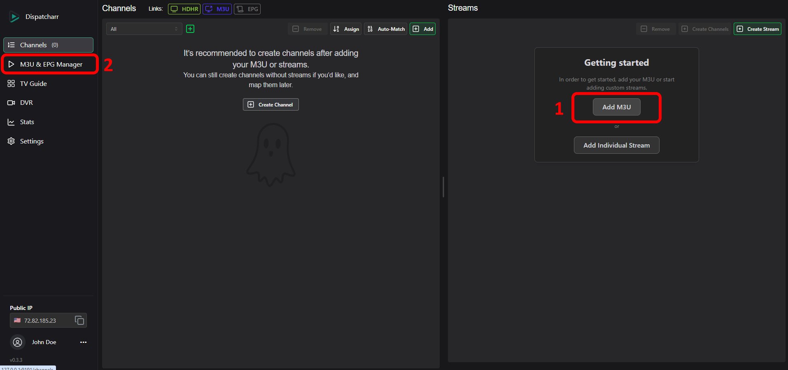
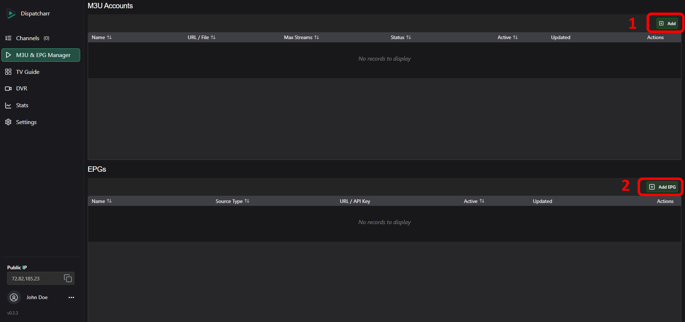
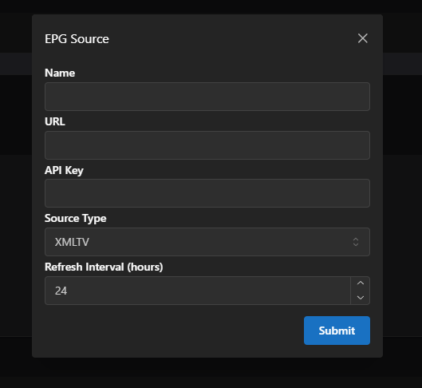
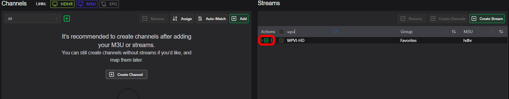
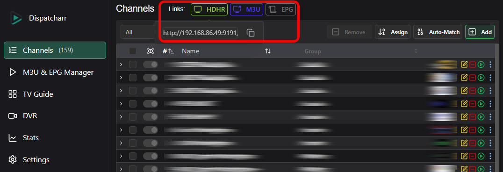
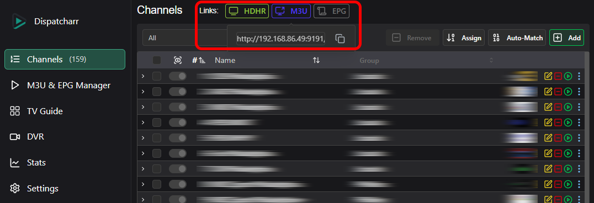
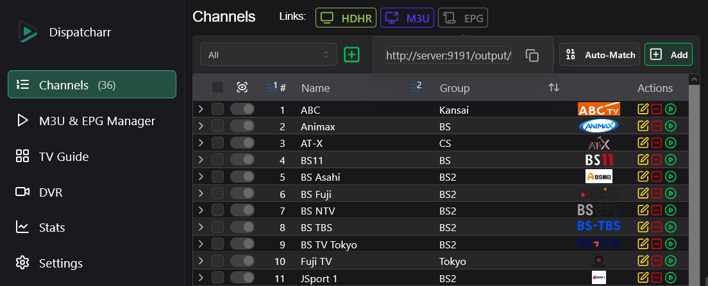

# Getting Started

Dispatcharr can be installed using Docker on various platforms, including Windows, macOS, Proxmox, and Unraid. This guide provides detailed instructions for each method.

## Installation

See [installation guide](installation.md).

---

## Startup

After installation and starting up, open a web browser and go to `http://{your_ip_here}:9191`
Create your user account by entering a username and password that you will remember. You can optionally add an email address.
!!! note
    Email addresses are currently unused but may be used in future versions.

---

## Adding M3U and EPG
1. Add your first M3U by clicking the `Add M3U` button on the right-hand side under "Getting started".  
2. This will take you to the M3U & EPG Manager (also accessible from the navbar on the left).  
??? info "Screenshot" 
    

1. Click the `Add` button under M3U Accounts to add an M3U  
2. Click the `Add EPG` button under EPGs to add an episode guide

??? info "Screenshot"
    
	
=== "M3U"
	- Enter a name for your M3U, then enter the M3U URL or upload your M3U file.  
	- You can optionally set a max number of concurrent streams allowed, or leave at 0 for unlimited.  
	- Click `Save`. 
    ??? info "Screenshot"
	    
	- Click the corresponding <i data-lucide="square-pen" style="color: gold; width: 18px;"></i> edit icon of the just added M3U account
	    - Click the `Groups` button and select which groups you'd like to add, then click `Save and Refresh`
	- Depending on the size of your M3U, it may take some time to load.	

	
=== "EPG"
    - Add an episode guide by clicking the `Add EPG` button under the EPGs section. .
    - Enter a name for your EPG, then enter the URL and if necessary, API key. 
    - Choose the source type, then hit "Submit".
    - Depending on the size of your EPG, it may take some time to load.
    ??? info "Screenshot"
	    

---

### Creating your first channel

- Go to the main Channels screen in the navbar. 
- If an M3U was added and successfully scanned, you should see a list of streams on the right side of the page under "Streams".  
- Find a stream in the list, or search for one by typing in the "Name" column header. 
- Press the green [+] create new channel button to add the stream to a new channel.  
??? info "Screenshot" 
    

---
	
### Media Playback Setup
#### Jellyfin
##### Add TV source
- Jellyfin can accept HDHR or M3U format. 
- In Dispatcharr, navigate to the "Channels" page then click either the HDHR or M3U buttons at the top of the page, and copy the provided URL.  
=== "HDHR"
    ??? info "Screenshot"
        
	
=== "M3U"
    ??? info "Screenshot"
        

- Navigate to your Jellyfin page and click the Admin Panel Icon to manage your Jellyfin server.  
- Click "Live TV" under the Live TV section, then the '+' button next to "Tuner Devices".  
??? info "Screenshot"
    
- Under 'Tuner Type', choose HD Homerun if using the HDHR URL, or M3U Tuner if using the M3U URL from Dispatcharr.  
- Paste the URL and save.  
!!! note
    If adding as M3U, leave the Simultaneous stream limit set as "0", since stream limits will be handled by Dispatcharr.  
##### Add Guide Data Source
- To add guide data from Dispatcharr, navigate to the Dispatcharr "Channels" page then click the EPG button at the top of the page and copy the provided URL.
??? info "Screenshot"
    
- In Jellyfin Live TV settings page, click the '+' next to "TV Guide Data Providers".
??? info "Screenshot"
    
- Choose 'XMLTV' and paste the URL
- EPG data will be automatically mapped.

---

#### Plex

- Plex accepts the HDHR format and can mostly find HDHR units on its own. 
- In Dispatcharr, navigate to the "Channels" page then click the HDHR button at the top of the page, and copy the provided URL.  
??? info "Screenshot" 
    
- Navigate to your Plex page and click the Settings icon to manage your plex server.  
- Scroll down to `Manage` and click `Live TV & DVR`, then `Set Up Plex Tuner`.
- Plex should automatically find your Dispatcharr instance, but if it doesn't click the `Don't see your HDHomeRun device? Enter its network address manually` and enter the HDHR URL you copied from Dispatcharr and press `Connect`.

??? info "Screenshot" 
    {style="height:70vmin"}

- Plex will provide you with their EPG if they support your country and postal code. If they do not provide EPG for you or if you want to use your own you can add EPG from Dispatcharr.
!!! warning
    Please note, if plex EPG does not exist for your area you will be forced to provide your own before you can continue.

??? info "Screenshot"
    {style="height:70vmin"}

- You can now map the epg to channels if any did not automatically match.
??? info "Screenshot"
    {style="height:70vmin"}
- Press `Continue` and plex will now load in the channels and EPG data

---

#### ChannelsDVR
add content here

---

#### Emby
##### Add TV source
- Emby can accept HDHR or M3U format. 
- In Dispatcharr, navigate to the "Channels" page then click either the HDHR or M3U buttons at the top of the page, and copy the provided URL.  
=== "HDHR"
    ??? info "Screenshot"
        
	
=== "M3U"
    ??? info "Screenshot"
        
- Navigate to your Emby page and click the Settings icon to manage your emby server.  
- Click "Live TV", then "Add TV source".  
- Choose HD Homerun if using the HDHR URL, or M3U if using the M3U URL from Dispatcharr.  
- Paste the URL and save.  
!!! note
    If adding as M3U, leave the Simultaneous stream limit set as "0", since stream limits will be handled by Dispatcharr.  
##### Add Guide Data Source
- You can use Emby provided guide data, guide data from dispatcharr, or a combination of both.
  - To add Emby provided guide data, click "Add Guide Data Source", choose your country, then choose "Emby Guide Data" under Guide Data Source and hit Next.
  - Follow the provided prompts to find the channel data you need. You may add multiple Emby Guide Data sources if needed.
  - Emby will attempt to match channels to guide data, but you may need to manually map the guide data to your channels. You can do so at "Live TV" > Channels, or in the Emby metadata manager.
  - To add guide data from dispatcharr, navigate to the dispatcharr "Channels" page then click the EPG button at the top of the page and copy the provided URL.
  - In Emby Live TV settings page, click "Add Guide Data Source", choose your country, then choose "XMLTV" Guide Data Source and hit Next.
  - EPG data will be automatically mapped.
